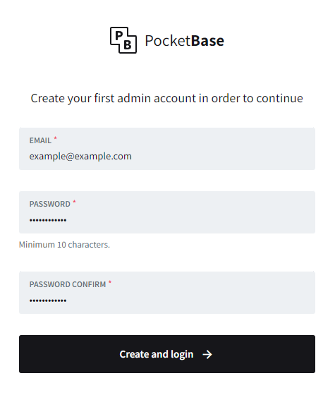
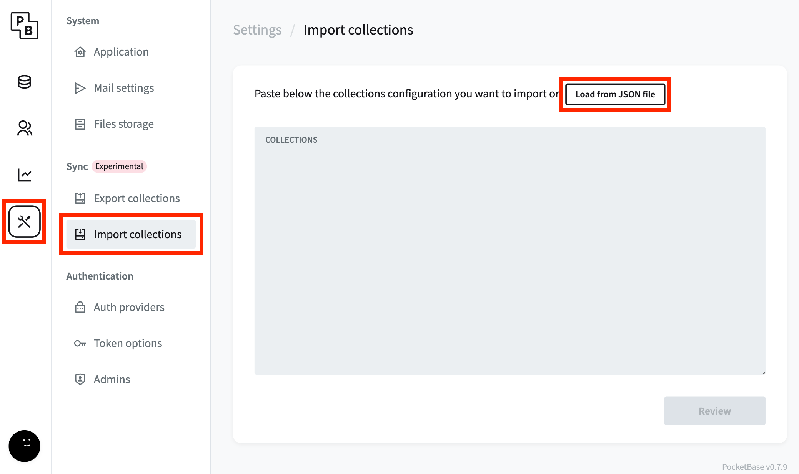
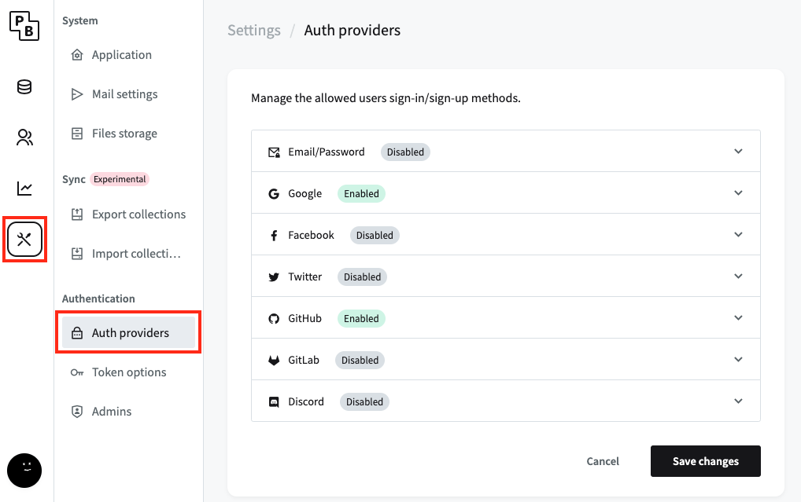

# Contributing

We ❤️ contributions to AquaHub to help make it better!
All contributions are welcome, including updates, issues, documentation and blog posts as well.

- [🛠️ Setup Development Environment](#-setup-development-environment)
- [⚙️ Configure Backend (PocketBase)](#-configure-pocketbase-backend)
- [📥 Pull Request Policy](#-pull-request-policy)
- [📂 File Structure](#-file-structure)
- [✅ Tests](#-tests)
- [💪 Other Ways to Help](#-other-ways-to-help)

## 🛠️ Setup Development Environment

> ⚠️ We recommend using [Visual Studio Code](https://visualstudio.microsoft.com/de/) as this guide is based on Visual Studio Code and its features

Branch naming convention is as follows

`TYPE/ISSUE_ID-DESCRIPTION` (Example: `feature/12-create-user-page`)

`TYPE` can be:

- **feature** - is a new feature
- **docs** - documentation only changes
- **bug** - a bug fix
- **refactor** - code change that neither fixes a bug nor adds a feature

For the initial start, fork the project and use git clone command to download the repository to your computer. A standard procedure for working on an issue would be to:

1. `git pull`, before creating a new branch, pull the changes from upstream. Your master needs to be up to date.

```
$ git pull
```

2. Install [Docker extension](https://marketplace.visualstudio.com/items?itemName=ms-azuretools.vscode-docker) to be able to run your devcontainer.

3. Reload your window (`CMD + Shift + P` > `"Developer: Reload Window"`). After the reload click on the button that's poping up in the right corner called `Reopen in Container`. You now started the devcontainer and it is setting everything up.

4. Create new branch from `master` like: `feature/12-create-user-page`<br/>

```
$ git checkout -b [name_of_your_new_branch]
```

5. Work - commit - repeat ( be sure to be in your branch )

6. If you're ready to create a **Pull Request** check out [📥 Pull Request Policy](#-pull-request-policy)

## ⚙️ Configure Backend (PocketBase)

In the Backend we use [PocketBase](https://pocketbase.io). It's a _Backend-as-a-Service_ that covers all our current needs for the beginning.

Still there's some stuff to configure at the start before you can start coding.

> ℹ️ PocketBase is automatically up and running after you started your devcontainer

- [Create admin user](#create-admin-user)
- [Import structure](#import-structure)
- [Configure OAuth2 provider](#configure-oauth2-provider)

### Create admin user

The **PocketBase UI** URL is [http://localhost:8090/\_](http://localhost:8090/_). The first time you visit this page you see this form where you create your first (admin) user. It doesn't matter what you fill in here as long as you remember it. You just need to access the web dashboard.

<p align="center" >
   
</p>

### Import structure

Download `.devcontainer/db.json` to your computer. Next, import it to PocketBase as shown below. After that click on "Review" and just click "Review" again without

<p align="center" >
   
</p>

### Configure OAuth2 provider

<p align="center" >
   
</p>

**Disable `Email/Password` provider**

#### Google

**We recommend creating a new project in the top navbar. It's just for testing.**

1. Visit: https://console.cloud.google.com/apis/credentials (Logged in with your Account)
2. Click on `+ CREATE CREDENTIALS` > `OAuth client ID`
3. _Application type_ > `Web application`
4. _Name_ is up to you. Only fil in `Authorized redirect URIs` > `http://localhost:5173/redirect`
5. Now you get a pop-up with `Client ID` & `Client secret`.
6. Paste the values from above into **PocketBase**. Leave everything else checked as it is.

#### GitHub

1. Visit: https://github.com/settings/developers (Logged in with your Account)
2. Click on `New OAuth App`
3. _Name_ is up to you.
   - **Homepage URL** > `http://localhost:5173`
   - **Authorization callback URL** > `http://localhost:5173/redirect`
4. Now you see `Client ID` & `Client secrets`.
5. `Generate a new client secret`
6. Paste the values from above into **PocketBase**. Leave everything else checked as it is.

## 📥 Pull Request Policy

Before you finally create your **Pull Request** please follow the tasks down below.

**All PRs must include a commit message with the description of the changes made!**

1. Format your code via this command in your root directory

```bash
yarn run format
```

2. Now, in addition, run the linter and get a list of found errors or warnings. Fix all errors and as many warnings as you can.

```bash
yarn run lint
```

3. Push changes to GitHub

```
$ git push origin [name_of_your_new_branch]
```

4. Submit your changes for review
   If you go to your repository on GitHub, you'll see a `Compare & pull request` button. Click on that button.
5. Start a Pull Request
   Now submit the pull request and click on `Create pull request`.
6. Get a `code review approval/reject` and after everything's fine merge the branch
7. _GitHub will automatically delete the branch after the merge is done. (they can still be restored)._

## 📂 File Structure

```bash
.
├── .devcontainer # Docker files and devcontainer config
├── src # Source folder
│   ├── lib
│       ├── components # UI components (also in ../routes if only on one page needed)
│       ├── guards # Guards to protect from accessing different pages
│       ├── helpers # Functions for additional functionality
│   ├── routes # Svelte routes
├── static # Statically served files
│   ├── assets # Necessary assets
├── tests # UI tests
```

## ✅ Tests

_Coming soon_

## 💪 Other Ways to Help

### Sending Feedbacks & Reporting Bugs

If you had any issues, bugs, or want to share about your experience, feel free to do so on our GitHub issues page or at our [Discord](https://discord.gg/GjJNf7zhgy).

### Submitting New Ideas

If you think AquaHub could use a new feature, please open an issue on our GitHub repository, stating as much information as you can think about your new idea and it's implications. We would also use this issue to gather more information, get more feedback from the community, and have a proper discussion about the new feature.

### Improving Documentation

Submitting documentation updates, enhancements, designs, or bug fixes. Spelling or grammar fixes will be very much appreciated.
